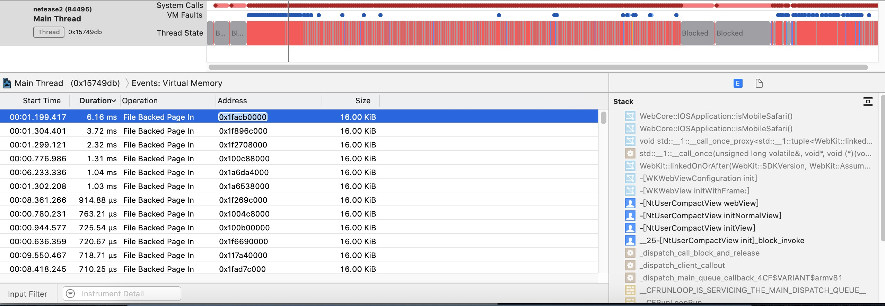

原文资料：

[https://mp.weixin.qq.com/s/Drmmx5JtjG3UtTFksL6Q8Q?utm_source=ZHShareTargetIDMore&utm_medium=social&utm_oi=32369423679488](https://mp.weixin.qq.com/s/Drmmx5JtjG3UtTFksL6Q8Q?utm_source=ZHShareTargetIDMore&utm_medium=social&utm_oi=32369423679488)
	
需要实验验证下，获取下数据看看效果。

### 核心
APP启动时需要加载函数到内存中，各个函数可能分布在不同的内存分页中，当需要运行函数，查找对应内存分页发现分页不存在时，会产生一个page fault， 系统会再加载一个分页到虚拟内存中，这样才能正常运行对应的函数，iOS这个过程需要签名，所以速度会比较慢。

要解决的问题

如何检查启动速度 -> 用 system trace

### 工具01 - System trace
是监控线程调用、线程占用CPU情况、虚拟内存fault的情况，等这些因素对APP的影响。可以查看到启动时，APP主线程调用时，Page Fault 的情况和每次占用的时间，全部占用时间这个还不知道如何统计。
Page Fault 对应的是 File Backed Page In， 从 Main Thread 的 Virtual Memory中可以查看。

这里可以看到 compactView 的 webview 加载还是比较占时间，其他的 File Backed Page In 占用的一般是几百微秒。

### 工具02 - Link Map File

Xcode 编译设置中